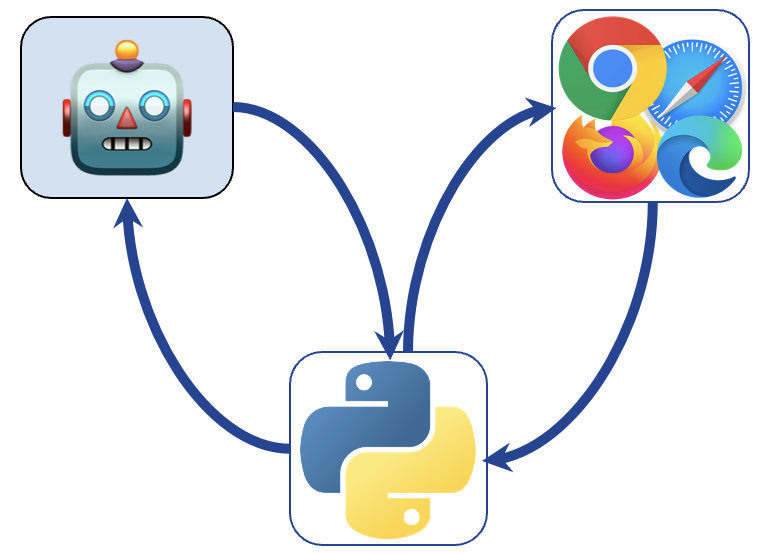

# TurkingBench: Challenging AI Agents with Web-based Tasks 

<hr>


This repository maintains a large collection of tasks and their natural language instructions that are grounded in the
visual information.

Here are two example tasks:


**Where can I see more tasks?**
You can see the instructions for each task [here](https://jhu-clsp.github.io/turk-instructions/mturk.html).
Note, in this visualization, the variables are not filled in with any variables.
During the evaluation, the variables are filled in with the input instances.
We have prepared the necessary scripts for simulating the interaction with the templates (see below).

**Note:** The repository expects Python 3.10 or later.

Background
--- 

**Why define tasks in natural language?** While the current dominant paradigm (supervised learning with task-specific
labeled examples) has been
successful in building task-specific models, such models can't generalize to unseen tasks; for example, a model that is
supervised to solve questions
cannot solve a classification task. We hypothesize that a model equipped with understanding and reasoning with natural
language instructions should be able to generalize to any task that can be defined in terms of natural language.

**How is it tied to the past work?**
Most of the past work focus on raw-text task instructions. Here the instructions are multi-modal
and grounded in the visual information.

**How did we collect this data?**
We have collected about XX tasks that were originally created for crowdworkers.
Each task comes with an HTML template `template.html` that contains the visual information and a natural language
instruction.
Additionally, the templates contain variables to be filled in by input instances maintained in `batch.csv` files.


Task schema
--- 
Each task consists of the following files:

- `template.html`: This is the HTML template that is used to visualize the content of the task, including instructions,
  variables for visualizing the inputs, and HTML elements for collecting responses.
- `batch.csv`: Contains the collection of inputs and outputs. The inputs are placed in the HTML template. The outputs
  are used to compute the performance of a model solving these tasks.

How to contribute
---
We welcome addition of more tasks too the collection! If intetested, please open a Pull-Request for your tasks.


Setting up the evaluation tasks
--- 
To facilitate the evaluation of models on this data, we have included the scripts needed to simulate interaction with
the templates.
Here are the steps you need to follow:

1. Install the dependencies: `pip install -r requirements.txt`. Then enter the `src/` directory to for the rest of the
   steps.
2. Create a server for visualizing the tasks `./1_run_website.sh` This will create a clone
   of [Turkle](https://github.com/hltcoe/turkle/) server at `http://localhost:8000` which is an engine for simulating
   Mechanical Turk locally. At this point you will see no tasks on Turkle; we will upload them in next step. If you see
   an error message that "Directory Turkle exists." remove this directory `rm -rf Turkle` and retry this step. If
   successful, you should be able to see the Turkle server running at `http://localhost:8000` and you should be able to
   log in with the username and password you provided. At this point, Turkle will show "No Tasks available at this
   time". We will add the tasks in the next two steps.
3. Create input files for each task by running `python 2_generate_input_csv.py`. This will create a `input.csv` file for
   each task which we will be used for uploading the tasks to Turkle. You might ask why `input.csv` are necessary (they
   might seem like duplicates of `batch.csv`)? There are two key differences: (1) `input.csv` files only contain the *
   *inputs** shown to crowdworkers (no labels). (2) `input.csv` files are a bit shorter than `batch.csv` files since
   they only contain the unique inputs (which is how Turkle expects).
4. Now open another terminal tab and run the script for copying the tasks to the
   server `python 3_upload_tasks.py`. While this script is running, you can go back to Turkle to see that the tasks are 
   indeed being uploaded.

At this point, you should be able to see the tasks on Turkle. For example, if you open http://localhost:8000/task/4427/assignment/1/ you should be able to see the
following visualization:


# Interacting with the tasks and evaluating the oracle baselines

Here we brief description the interaction protocols. 
Specifically, this Python library here is meant to act as an intermediary between 
an AI system and AI system (see the picture). 
Every time that the AI system needs to interact with the task, it will make call the Python library, which is then executed on 
the browser. The Python library will then return the results back to the AI system.


## Running the oracle model: 
A quick way to see how the model execution is expected to look like is to run our oracle baseline which has access to the ground-truth labels. 
Run the script for evaluating the baseline by passing in the names of the
tasks: 
```bash
python3 4_run_evaluation.py --solver_type oracle  --tasks test_easy  --max_instance_count 20
```

This open a browser and show the execusion of the oracle model on the test tasks. 
Under the hood, the oracle model is generate a sequence of commands (Python commands from our action library) that ultimately get executed on each task (web page). The picture below shows this idea: 


After this is done, the code will dump a JSON and a CSV file containing the results of the oracle model.
If you want to run this faster without the visualization, you can set `--headless` flag.

**Note:** To use Chrome as your webdriver, you need to first download the ChromeDriver executable from the ChromeDriver website and make sure it’s in your system’s `PATH`.

## The existing baseline models and evaluating them 
You can find a list of baseine models here: [baselines.py](src%2Fevaluation%2Fbaselines.py)
You can run these existing baselines by specifying the `solver_type` argument in the above script.
You can also add your own models by adding a new class to the `baselines.py` file.

## Optional: Dumping the input/output data for offline training/evaluation  
There are scenarios that you may want to build a model that is trained on the input/output pairs of the tasks.
But doing this is not efficient when you need to interact with thr browser for each task.
As a result, we have created a functionality that allows you to dump the features of the tasks.
The oracle model can be used to dump the training features that can be used for training other models.
All need to be done is to set `dump_features=True` in the above script.
You can find our script in `src/5_dump_features.py` that dumps the features for all tasks.
The dumped features contain both visual content as well as the HTML content of the tasks.
One can basically use either source of signals depending on the model.
The output of these models will be strings (sequence of Python actions) that will be executed on the browser.
 
Upon training an offline training of the model, you can also generate predictions of your model and evaluate these predictions. 
This functionality is implemented in `4_run_evaluation.py` by specifying the solver to be "offline_predictions". 
In this setting, you also will need to pass in the address of a file that contains the predictions of your model.  


License
--- 
This work is licensed under Apache License 2.0.
