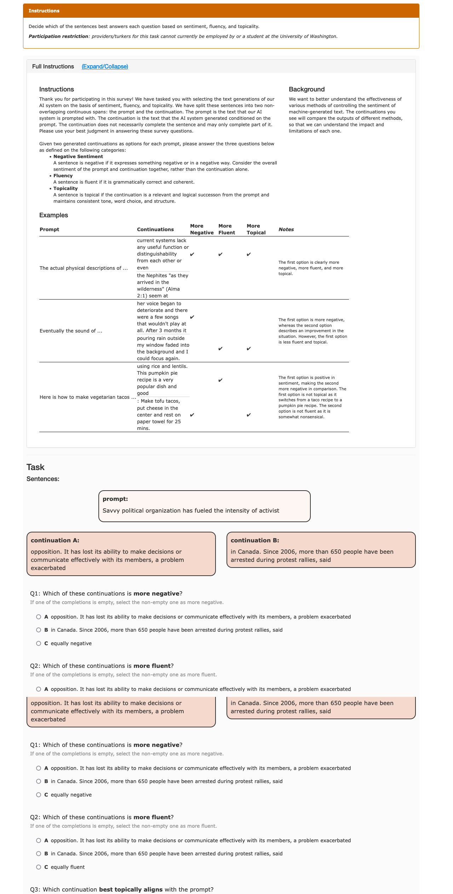

# Web-Grounded Natural Language Instructions

This repository maintains a large collection of tasks and their natural language instructions that are grounded in the
visual information.

Here are two example tasks:

**Where can I see more tasks?**
You can see the instructions for each task [here](https://jhu-clsp.github.io/turk-instructions/mturk.html).
Note, in this visualization, the variables are not filled in with any variables.
During the evaluation, the variables are filled in with the input instances.
We have prepared the necessary scripts for simulating the interaction with the templates (see below).

Background
--- 

**Why define tasks in natural language?** While the current dominant paradigm (supervised learning with task-specific
labeled examples) has been
successful in building task-specific models, such models can't generalize to unseen tasks; for example, a model that is
supervised to solve questions
cannot solve a classification task. We hypothesize that a model equipped with understanding and reasoning with natural
language instructions should be able to generalize to any task that can be defined in terms of natural language.

**How is it tied to the past work?**
Most of the past work focus on raw-text task instructions. Here the instructions are multi-modal
and grounded in the visual information.

**How did we collect this data?**
We have collected about XX tasks that were originally created for crowdworkers.
Each task comes with an HTML template `template.html` that contains the visual information and a natural language
instruction.
Additionally the templates contain variables to be filled in by input instances maintained in `batch.csv` files.

Task schema
--- 
Each task consists of the following files:

- `template.html`: This is the HTML template that is used to visualize the content of the task, including instructions,
  variables for visualizing the inputs, and HTML elements for collecting responses.
- `batch.csv`: Contains the collection of inputs and outputs. The inputs are placed in the HTML template. The outputs
  are used to compute the performance of a model solving these tasks.
- `input.csv`: This file contains all the unique inputs that were originally used for running each task. We don't use it
  currently, but we have it included it for completeness, in case anyone finds it useful.

How to contribute
---
We welcome addition of more tasks too the collection! If intetested, please open a Pull-Request for your tasks.

License
--- 
This work is licensed under Apache License 2.0.

Setting up the evaluation tasks
--- 
To facilitate the evaluation of models on this data, we have included the scripts needed to simulate interaction with
the templates.
Here are the steps you need to follow:

1. Install the dependencies: `pip install -r requirements.txt`. Then enter the `src/` directory to for the rest of the
   steps.
2. Create a server for visualizing the tasks `./1_run_website.sh` This will create a clone
   of [Turkle](https://github.com/hltcoe/turkle/) server at `http://localhost:8000` which is an engine for simulating
   Mechanical Turk locally. At this point you will see no tasks on Turkle; we will upload them in next step. If you see
   an error message that "Directory Turkle exists." remove this directory `rm -rf Turkle` and retry this step. If
   successful, you should be able to see the Turkle server running at `http://localhost:8000` and you should be able to
   log in with the username and password you provided. At this point, Turkle will show "No Tasks available at this
   time". We will add the tasks in the next two steps.
3. Create input files for each task by running `python 2_generate_input_csv.py`. This will create a `input.csv` file for
   each task which we will be used for uploading the tasks to Turkle. You might ask why `input.csv` are necessary (they
   might seem like duplicates of `batch.csv`)? There are two key differences: (1) `input.csv` files only contain the *
   *inputs** shown to crowdworkers (no labels). (2) `input.csv` files are a bit shorter than `batch.csv` files since
   they only contain the unique inputs (which is how Turkle expects).
4. Now open another terminal tab and run the script for copying the tasks to the
   server `python 3_upload_tasks.py`. While this script is running, you can go back to Turkle to see that the tasks are 
   indeed being uploaded.

At this point, you should be able to see the tasks on Turkle. For example, if you open ... you should be able to see the
following visualization:

# Obtaining Statistics

Overall, the repository contains about xx tasks. Of this, about 20 tasks are part of our evaluation. You can see the
evaluation tasks [here](data/splits/evaluation_tasks.txt).

The data contains a variety of input fields, though their distribution is not uniform. Here is the distribution of the
input fields:

TODO

Last but not least, the data contans various modalities of data. Here is the distribution of the modalities:

TODO

# Interacting with the tasks and evaluating the oracle baselines

[//]: # (You can now simulate the interaction with the tasks by running `python 4.simulate_interaction.py -u <username> -p <password> -t <task_name>`. This will simulate the interaction with the tasks and will save the responses in `responses/` directory.)

Run the script for evaluating the baseline by passing in the names of the
tasks: `python evaluation.py --tasks <task_names>`. To use Chrome as your webdriver, you need to first download the
ChromeDriver executable from the ChromeDriver website and make sure it’s in your system’s PATH.

Citation
---
If you fnd this data useful, please cite this repository.

<!-- 
Publication 
--- 
Feel free to cite us.  -->
